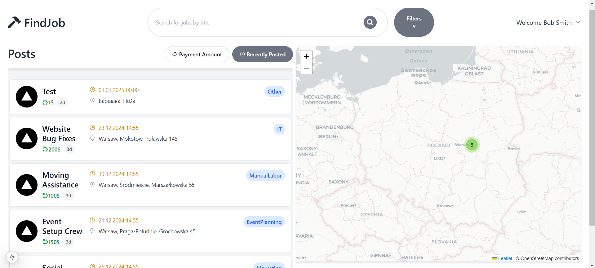

# Job Posting Web Service

This project is a comprehensive **job posting platform** designed to facilitate the process of posting, searching, and applying for one-time jobs. The application is built with a **microservices architecture** using .NET and incorporates modern technologies and design principles to deliver a robust, scalable, and user-friendly experience.

## Features

### 1. Job Listings Management
- Employers can create, update, and delete job postings.
- Job postings include details such as:
  - Job title
  - Description
  - Location
  - Payment amount

### 2. Interactive Map Integration
- An **interactive map** is included to display job locations visually.
- Users can search for jobs based on their geographic location and view results directly on the map.

### 3. Search Functionality
- Advanced search options are available, allowing job seekers to filter listings by:
  - Keywords
  - Location
  - Payment range
  - Job categories
- Search results are paginated for a seamless browsing experience.

### 4. Authentication & Authorization
- Integrated with an **external Identity server (Duende)** to handle user authentication securely.
- Role-based access control (RBAC):
  - Employers can post and manage jobs.
  - Job seekers can search for and apply to jobs.

### 5. Event-Driven Architecture
- Uses **RabbitMQ** with MassTransit for an efficient **event bus** system:
  - Ensures smooth communication between microservices.
  - Handles events such as job posting creation, updates, and notifications.

### 6. Notifications (Planned)
- A notification service will be implemented to inform users about:
  - New job postings matching their preferences.
  - Updates to existing jobs they have bookmarked.

### 7. Responsive Design
- The front-end is built using **React**, providing a responsive and intuitive interface that works across devices.

## Technology Stack

### Backend
- **.NET Core**: Main framework for developing APIs and business logic.
- **Entity Framework Core**: ORM for database interactions.
- **RabbitMQ + MassTransit**: Event-driven architecture.

### Frontend
- **Next.js**: For building an interactive and responsive user interface.
- **Blazor (for IdentityService)**: Adds functionality that is not provided by Duende.

### Database
- **PostgreSQL**: Main database for storing job postings and user data.
- **MongoDB**: Used for data access, sorting, searching and so on (Planned to be replaced by Elasticsearch).

### Containerization
- **Docker**: For containerizing all services and databases, ensuring consistency and ease of deployment.

### Testing
- **xUnit**: Comprehensive unit and integration tests to ensure reliability.

## Architecture

The application is designed with a **microservices architecture** to achieve modularity and scalability. Each service is responsible for a specific feature, such as job management, search, or notifications.

### Services
1. **Job Service**: Handles CRUD operations for job postings.
2. **Search Service**: Manages indexed data and provides search functionalities.
3. **Identity Service (In Progress)**: Manages user profiles and authentication.
4. **Notification Service (Planned)**: Handles user notifications and updates.

### Communication
Services communicate through an **event-driven model** using RabbitMQ. This decouples components and ensures system resilience.

## How to Run

1. **Clone the Repository**
   ```bash
   git clone <repository-url>
   ```
2. **Set Up Docker**
   Ensure Docker is installed and running on your machine.
3. **Run Services**
   Navigate to the project directory and start all services using Docker Compose:
   ```bash
   docker-compose up
   ```
4. **Access the Application**
   - Frontend: `http://localhost:3000` (or specified port)
   - Gateway: `http://localhost:6000` (or specified port)

## Future Enhancements
- Complete implementation of the notification and bidding services.
- Add support for multilingual interfaces.
- Optimize database queries for faster search results.

## Screenshots


